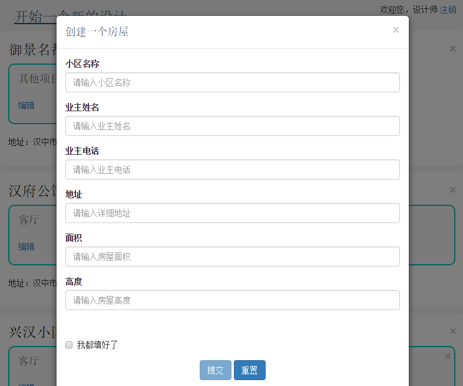

## 当年的毕业设计

工作后再来看，其实做的很low，但是目前工作基本不做C#和.NET了，也基本没时间有优化完善。有同学问我要代码，自己也找了好久才找到（之前很多代码都丢了），所以就放在这里做备份了。

- **GitHub** : [https://github.com/cdswyda/Budget](https://github.com/cdswyda/Budget)

- **Coding** : [https://coding.net/u/cdswyda/p/Budget/git](https://coding.net/u/cdswyda/p/Budget/git)

## 结构

- `Data` 目录为数据文件

- `Released` 目录为编译后的文件

- `_images` 几张图，预览的，项目无关。

- 下面这四个目录的都是源码 

  | - `Budget.DAL`

  | - `Budget.BLL`
  
  | - `Budget.MODEL`
  
  | - `Budget.WEB`


## 查看

1. `Data` 目录下为数据库文件，进行还原即可。（我在 **SQL Server 2014** 上用过了，要还原的话， 要版本大于等于2014，不能还原的话，目录下还提供了脚本。）

2. 修改数据库连接，编译后的直接修改`\Released`下的`Web.config`文件，源码的在`\Budget.WEB`目录下。

```xml:n
<connectionStrings>

  <add name="ConnectionString" connectionString="Data Source=.\sqlexpress;Initial Catalog=Budget;Integrated Security=True" providerName="System.Data.SqlClient"/>

</connectionStrings>
```

上面的`providerName`属性不能删除，用微软企业库操作数据库的，应该是可以支持不改变逻辑切换数据库的，这个属性是指明我们用的是Sql Server (嗯，我现在还记得`System.Data.SqlClient`这个命名空间)

3. 直接部署到IIS 或者打开VS即可。

4. 登录名和密码，自己去数据库看喽。（真的好low，那时候连加密都没做）

## 预览

别处扒来的首页，为了好看点。


登录： 也是扒的


设计师管理页


下面是客户的留言。这块当时好像没做完...


查看汇总报表


导出，不会用后台拼，直接前端js导的，部分中文支持有问题。。。


房间的切换和编辑


new 一个 House



在 House 里 new 一个 Room


